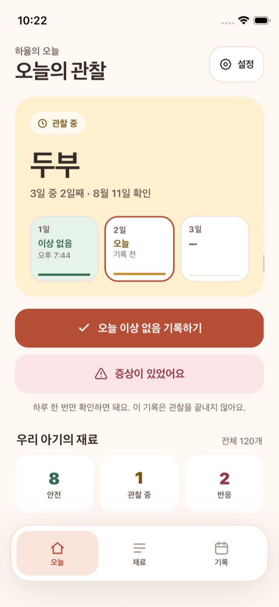
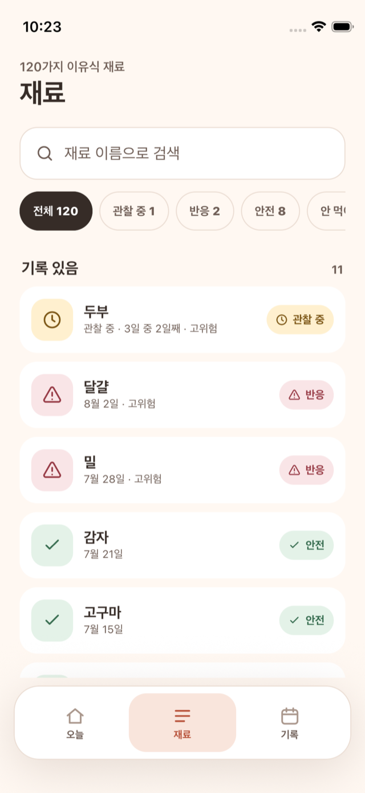
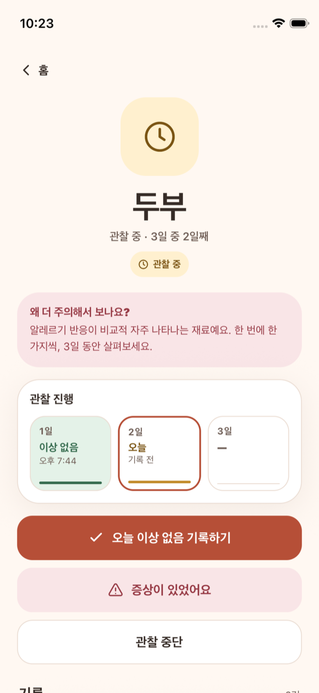
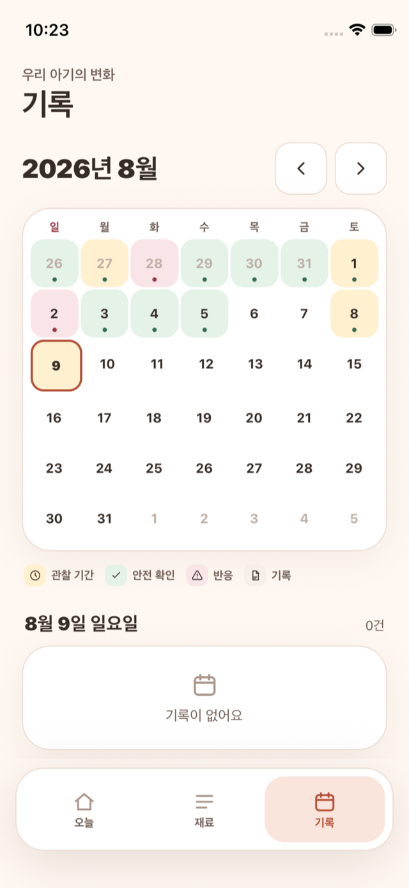
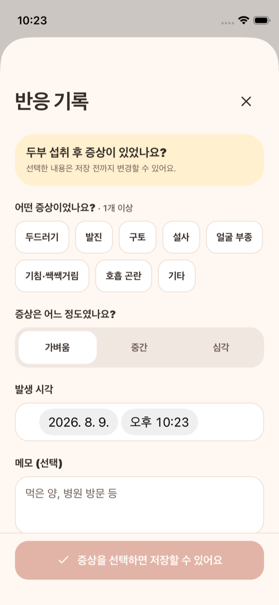
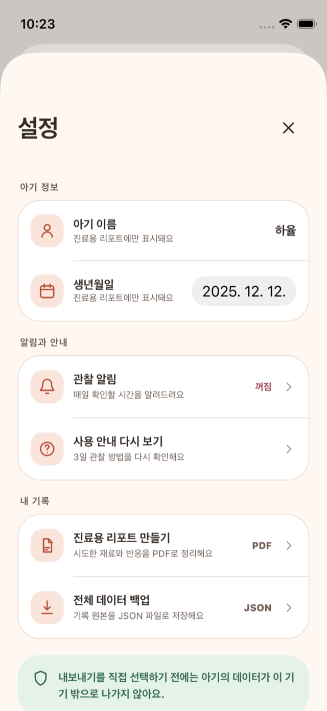

<div align="center">

<picture>
  <source media="(prefers-color-scheme: dark)" srcset="docs/logo-dark.svg">
  
</picture>

</div>

<table>
<tr>
<td width="42%">

</td>
<td width="58%">

### One food at a time.<br>Three days of watching.

A food reaction can surface **up to three days after** the feed. Across months
of weaning, that makes this a memory problem before it is anything else: what
went in, when, what happened, and what is still untested.

This is that memory — a private notebook that turns the food list into a
traffic light. **It has no accounts, no server, and no network code at all.**
Everything lives in one SQLite file on the phone.

Native iOS · Korean-only UI · built as a portfolio project and dogfooded on a
real device.


[](https://github.com/mhju0/allergy-tracker/actions/workflows/ci.yml)

</td>
</tr>
</table>

<div align="center">

<picture>
  <source media="(prefers-color-scheme: dark)" srcset="docs/status-key-dark.svg">
  
</picture>

</div>

## There is no status column

Every food's status is computed from its trial history, every time it is read.
Nothing stores it, so nothing can disagree with the record:

```ts
// src/domain/status.ts — verbatim
export function deriveStatus(trials: TrialLike[]): FoodStatus {
  const latest = latestTrial(trials);
  if (!latest) return 'untried';
  switch (latest.outcome) {
    case null:
      return 'testing';
    case 'safe':
      return 'safe';
    case 'reacted':
      return 'reacted';
    case 'cancelled':
      // unreachable: latestTrial filters cancelled trials
      throw new Error('deriveStatus: cancelled trial escaped latestTrial filter');
  }
}
```

That exhaustive switch is the whole state machine. Adding an outcome to the
schema fails the typecheck here until it is handled, and a delayed reaction —
logged weeks after a food was marked safe — flips it back to red for free,
because there was never a cached answer to invalidate.

## One food at a time, enforced

The rule that makes every other record trustworthy: while a food is inside its
window, starting another one is blocked. Isolating the variable is the entire
medical point of a food trial, so it is a guard in the mutation, not a
convention.

```
introduce a food ──▶ 관찰 중   the 3-day window opens
                     │
                     │  이상 없음 check-ins — evidence, never a status change
                     │
                     ├─ log a reaction     ──▶ 반응  · pending reminders cancelled
                     ├─ confirm it safe    ──▶ 안전  · only once the window elapsed
                     ├─ start the next one ──▶ 안전  · moving on IS the confirmation
                     └─ stop the trial     ──▶ record kept, reverts to prior status

a reaction logged on an already-safe food ──▶ 반응
```

Guidance from 질병관리청, 대한소아청소년과학회, NHS and CDC converges on the same
two rules — one new food at a time, and watch for two to three days. The full
data model, derivation rules and edge cases are in
[docs/design-spec.md](docs/design-spec.md).

## The screens

<table align="center">
  <tr>
    <th align="center">Today</th>
    <th align="center">Foods</th>
    <th align="center">Food detail</th>
  </tr>
  <tr>
    <td></td>
    <td></td>
    <td></td>
  </tr>
  <tr>
    <th align="center">History</th>
    <th align="center">Log a reaction</th>
    <th align="center">Settings</th>
  </tr>
  <tr>
    <td></td>
    <td></td>
    <td></td>
  </tr>
</table>

The Warm Care UI keeps the **observation ledger** at the center — one named cell
per day of the window — while one primary action and a persistent labeled bottom
bar make the next click obvious on first use.

## What it does

- **A fixed 3-day window** with gentle local check-in reminders and a
  window-end prompt. No push service — every notification is scheduled on the
  device.
- **이상 없음 one-tap check-ins** record "nothing seen today" without ending the
  trial. Affirmative evidence, not just the absence of an alarm.
- **Delayed reactions handled properly** — logging one against a food already
  marked safe flips it back to 반응, which is how real allergies surface.
- **A calendar that means something** — days a food actually cleared are green,
  days under observation amber, reactions red. Future days are never shaded.
- **120 curated Korean weaning foods**, 44 of them flagged 고위험 — the big-9
  allergen groups plus Korean staples (메밀, 잣, 밤).
- **A doctor-ready PDF** of every food tried and every reaction logged, plus a
  JSON export — both generated on device and handed to the share sheet.

## How it is built

| Layer | Choice |
| --- | --- |
| App | Expo SDK 57 · React Native 0.86 · TypeScript (strict) |
| Navigation | Expo Router — file-based, typed routes, persistent labeled bottom bar |
| Data | expo-sqlite + Drizzle ORM, generated migrations committed |
| Domain | Pure TypeScript core, built test-first — Jest, 201 tests |
| Notifications | expo-notifications — all local, no push service |
| Localization | i18next — Korean-only by design, dates pinned to `ko-KR` |
| UI | Hand-rolled Warm Care design system, no component library |

- **The UI is a thin layer over tested logic.** Status derivation, the
  start-trial decision including the implicit-safe autoclose, notification
  scheduling and calendar maths are all side-effect-free modules.
- **Colour is measured, not eyeballed.** `src/ui/tokens.test.ts` computes WCAG
  contrast from the palette and fails the build if any value that carries text
  drops below 4.5:1.
- **Accessible by construction.** A status colour never travels without its
  icon and label; primary controls use 48&nbsp;pt-or-larger touch targets.
- **The demo fixture is code.** A deterministic, invariant-tested seed builds a
  month of plausible history — every observed day recorded, times varied by a
  hash rather than `Math.random`, so it rebuilds byte-identically for
  screenshots.

```
app/          screens (typed routes + persistent top-level navigation)
src/domain/   pure logic — status, trial rules, scheduling, calendar maths
src/data/     mutations, live queries, the shared start-trial flow
src/db/       schema, seed + catalogue, demo fixture
src/services/ local notifications, PDF/JSON export builders
src/ui/       design tokens (single source of colour) + shared components
```

## Run it

```bash
npm install
npx expo run:ios       # dev build on the simulator
npx jest               # 201 unit tests
npx tsc --noEmit       # typecheck
```

Boot it pre-filled with a month of history — 11 trials, two reactions, daily
check-ins, one food mid-window:

```bash
EXPO_PUBLIC_DEMO=1 npx expo run:ios
```

The demo seed only fires when the database has no profile yet, so real installs
are never touched.

## Privacy

There is no network code in the app. Nothing is collected, synced or sent
anywhere — the only way data leaves the phone is a PDF or JSON file you hand to
the share sheet yourself.

## Status

Feature-complete and in maintenance mode. © 2026 Michael Ju.

> [!IMPORTANT]
> 이 앱은 기록 보조 도구이며 의학적 조언이 아닙니다 — a tracking aid, not medical
> advice. Always consult your paediatrician about allergies.

## License

Copyright (c) 2026 Michael Ju. All rights reserved.
No license is granted for use, copying, modification, or distribution of this code as of 2026-07-30. This repository is public for portfolio review purposes only.
